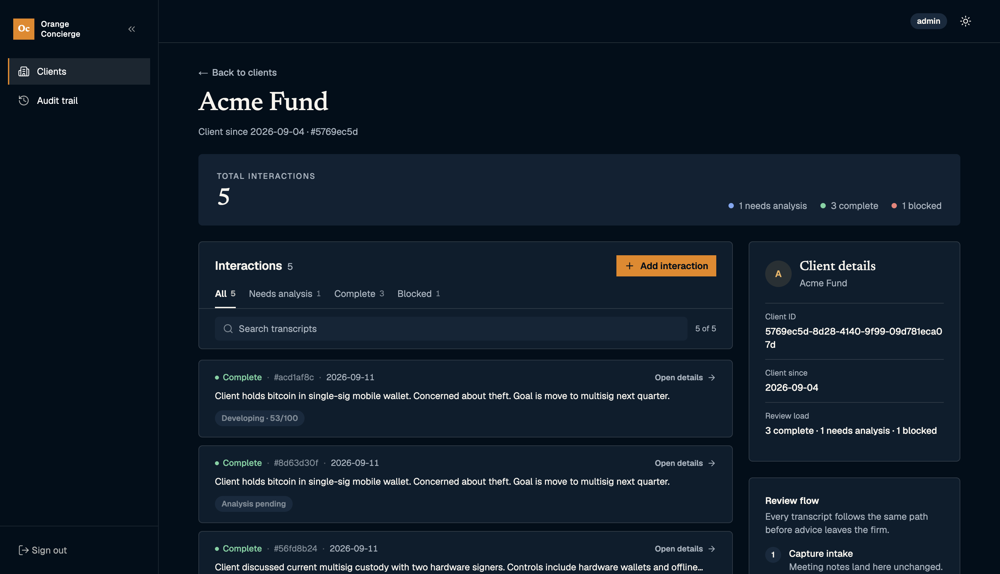

# Orange Concierge - Sovereign Client Operations Copilot

Orange Concierge is a self-hosted AI copilot for Bitcoin consultants. It turns client notes and meeting transcripts into evidence-backed recommendations and review-ready action plans.

Before any model or embedding call, it scans for wallet seeds, private keys, API keys, recovery codes, and similar prohibited secrets.


## What It Does

- Accepts consultant notes and client meeting transcripts.
- Rejects prohibited secrets before any model or embedding call.
- Extracts structured facts with supporting evidence.
- Retrieves relevant internal guidance through RAG.
- Generates cited recommendations for human review.
- Enforces role-based approval and audit rules in application code.

## Stack

- **Application:** Next.js 16, React 19, TypeScript
- **Data:** PostgreSQL, pgvector, Drizzle ORM
- **Auth:** Better Auth
- **AI:** Ollama, Gemini
- **Testing:** Gherkin + Vitest-cucumber, Playwright, Testcontainers
- **Infrastructure:** Docker Compose, Nginx
- **CI:** GitHub Actions
- **Workspace:** pnpm workspaces

## Project Structure

```text
orange-concierge/
├── apps/
│   └── operations/              # Next.js operations app
├── packages/
│   ├── core/                    # Framework-free use cases, policies, domain rules, and ports
│   ├── infrastructure/          # Database, auth, audit, scanner, knowledge, and composition
│   └── ai/                      # Ollama/Gemini model adapters
│
├── knowledge/                   # Seeded Markdown playbooks for retrieval and citations
├── docs/                        # Project architecture deep dive
├── docker-compose*.yml          # Local/self-hosted service definitions
├── nginx.conf                   # Reverse proxy and rate-limit template
└── pnpm-workspace.yaml          # Workspace package boundaries
```

More details on the architecture: [`docs/architecture.md`](docs/architecture.md).

## Run Locally With Ollama

Copy the development environment file:

```bash
cp .env.development.example .env
```

And run the following commands.

```bash
pnpm install
docker compose up -d db ollama ollama-pull
pnpm db:migrate
pnpm db:seed
pnpm knowledge:index
pnpm dev
```

Then Open: http://localhost:3000.

`ollama-pull` fetches the configured chat model plus `nomic-embed-text` for `pnpm knowledge:index`.

## Run Locally With Gemini Cloud

Copy the development environment file and install dependencies:

```bash
cp .env.development.example .env
pnpm install
```

Edit your .env file:

```bash
AI_PROVIDER=gemini
AI_MODEL=gemini-1.5-flash
AI_API_KEY=your-gemini-api-key
AI_BASE_URL=https://generativelanguage.googleapis.com/v1beta
```

Then run Postgres and boot the app:

```bash
docker compose up -d db
pnpm db:migrate
pnpm db:seed
pnpm knowledge:index
pnpm dev
```

And Open: http://localhost:3000

Gemini extraction uses `AI_MODEL`; knowledge indexing uses `text-embedding-004`.

## Useful Commands

```bash
pnpm typecheck
pnpm build
pnpm test:core
pnpm test:e2e
pnpm knowledge:index
```
