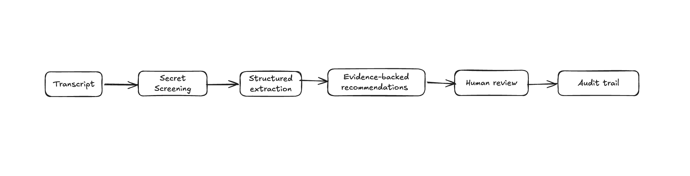
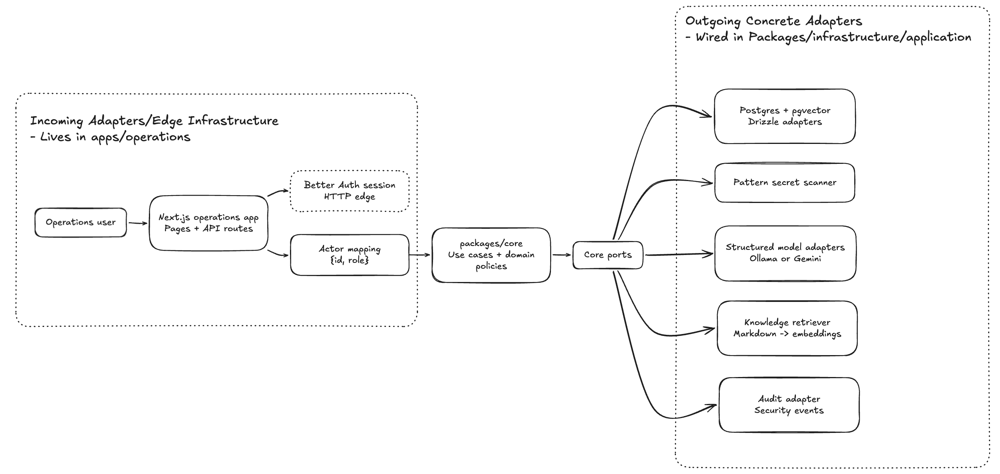
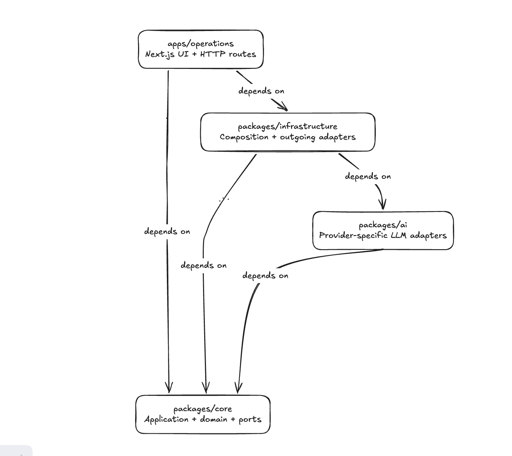
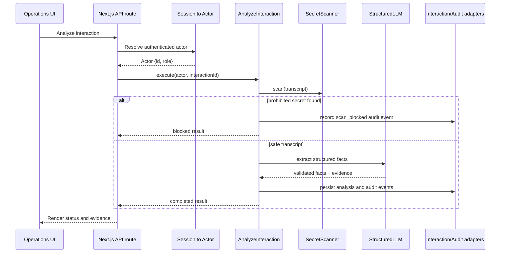
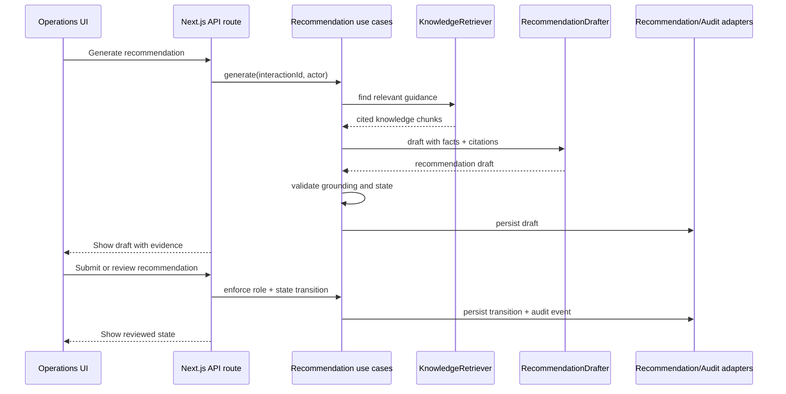
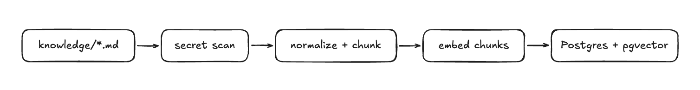
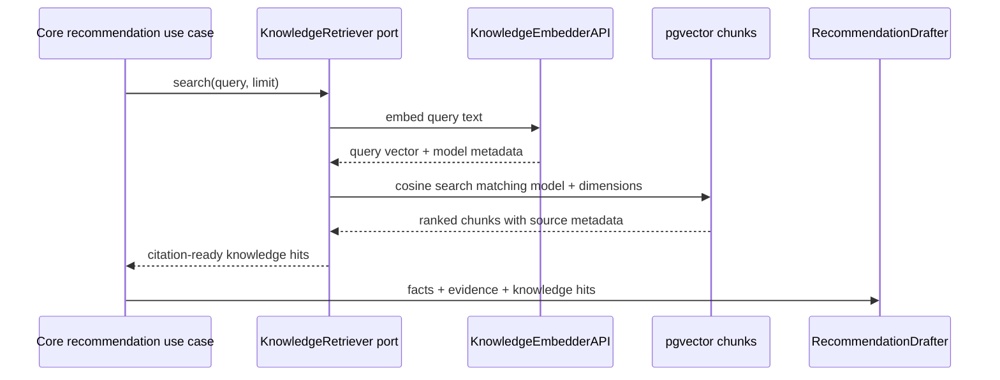

# Architecture

Orange Concierge is currently designed around one workflow:



The main architectural decision is that `packages/core` owns the business logic and depends only on contracts/abstractions, not on concrete incoming adapters/edge infrastructure like Next.js and Better Auth or concrete outgoing adapters like Drizzle, Postgres, Ollama, or Gemini.

## Quick Links

- [Architecture Diagram](#architecture-diagram)
- [Workspace Dependency Direction](#workspace-dependency-direction)
- [Interaction Analysis Sequence](#interaction-analysis-sequence)
- [Recommendation Review Sequence](#recommendation-review-sequence)
- [RAG Pipeline](#rag-pipeline)
- [Auth And Authorization](#auth-and-authorization)
- [Security Boundaries](#security-boundaries)
- [Why This Shape](#why-this-shape)
- [Future Improvements](#future-improvements)

## Architecture Diagram



## Workspace Dependency Direction



#### - `packages/core`

This houses the prized jewels. It owns use cases, policies, domain types, and ports.

The most important core use cases are:

- `SubmitInteraction`: records a consultant transcript for a client.
- `AnalyzeInteraction`: scans for prohibited secrets before model extraction.
- `VerifyInteractionFacts`: lets a human confirm extracted facts.
- `GenerateRecommendations`: retrieves internal guidance and drafts cited recommendations.
- `SubmitRecommendationForReview`: moves a draft into review.
- `ReviewRecommendation`: enforces reviewer/admin approval and rejection rules.
- `ListAuditEvents`: exposes audit events only to reviewer/admin roles.

The core runs high value unit tests against in-memory adapters, This allows the business rules to be tested against a myriad of edge cases without Next.js, Better Auth, Drizzle, Postgres, or a live model.

#### - `apps/operations`

This is the Next.js web app the consultants interact with. It owns concerns like pages, route handlers, request validation, cookies, and browser state.
It runs E2E tests for the key flows with Playwright and Testcontainers. It is currently the single deployable unit of the project.

#### - `packages/infrastructure`

This is the runtime wiring layer. It connects core ports to concrete adapters: database access, auth runtime setup, secret-scanner implementation, knowledge indexing/search, and environment parsing.

#### - `packages/ai`

This owns provider mechanics: Ollama and Gemini request shapes, response parsing, timeouts, and structured-output schema forwarding.

## Interaction Analysis Sequence



## Recommendation Review Sequence



## RAG Pipeline

Orange Concierge indexes trusted Markdown playbooks into pgvector, then retrieves relevant guidance during recommendation generation. The model drafts from three inputs: client facts, transcript evidence, and cited knowledge chunks. Core validates grounding before the draft is saved.

The key pieces are:

- `knowledge/*.md`: the internal guidance corpus.
- `packages/infrastructure/src/knowledge/index-cli.ts`: CLI entry point used by `pnpm knowledge:index`.
- `packages/infrastructure/src/knowledge/indexer.ts`: reads files, normalizes Markdown, extracts titles, chunks on `##` headings, hashes content, validates embedding counts and dimensions, and returns typed failures.
- `PatternSecretScanner`: scans source Markdown before embeddings are created so unsafe corpus content does not enter model or vector context.
- `createKnowledgeEmbedder`: selects the embedding adapter from the same AI provider config. Ollama uses `nomic-embed-text`; Gemini uses `text-embedding-004`.
- `DrizzleKnowledgeIndexRepository`: replaces `knowledge_sources` and `knowledge_chunks` in one transaction.
- `DrizzleKnowledgeSearch`: embeds a search query, filters chunks by embedding model and dimensions, ranks by cosine distance, and returns citation-ready hits.

### Ingestion



### Retrieval



## Auth And Authorization

Authentication stays at the HTTP edge. Better Auth owns sessions, cookies, and email/password login.

The app maps a session into a small core `Actor`:

```ts
type Actor = {
  id: string;
  role: 'admin' | 'consultant' | 'reviewer';
};
```

Authorization lives in core policies and use cases. That keeps direct HTTP calls and future adapters subject to the same role and state rules.

Examples:

- Consultants can submit and analyze interactions.
- Reviewers and admins can approve or reject recommendations.
- Consultants cannot approve recommendations, even by direct HTTP call.
- Audit trail access is limited to reviewer/admin roles.

## Security Boundaries

The no-secret-before-model invariant is currently the main security boundary.

Prohibited values are scanned before model calls, embeddings, normal persistence side effects, or audit metadata that would leak content. The scanner blocks seed phrases, private keys, API-key-like values, and recovery-code patterns.

The model extracts claims. Deterministic TypeScript code validates shape, calculates readiness, checks evidence, grounds recommendations, and enforces review state transitions.

## Why This Shape

- To keep business rules independent of frameworks, databases, auth libraries, and model providers.
- Enhanced testing flexibility
  - Fast running unit tests running against in-memory adapters can be used to validate multiple business rules and different edge cases without having to pull the entire infrastructure along.
  - Slower running E2E tests can be used to validate the major/high value user journeys

This shape introduces extra abstraction and wiring, but that tradeoff keeps the system easier to test, audit, and evolve.

## Future Improvements

- [ ] PII extraction to redact/minimize sensitive context from pasted transcripts before LLM calls
- [ ] Introducing a message queue to temporally decouple LLM calls from synchronous requests, so long-running analysis and recommendation jobs can retry, fail safely, and report async status.
- [ ] Observability (structured logs, metrics and tracing) for model latency, token usage/cost and provider failures tracking
- [ ] Evals for measuring model output quality
- [ ] Model and prompt versioning
